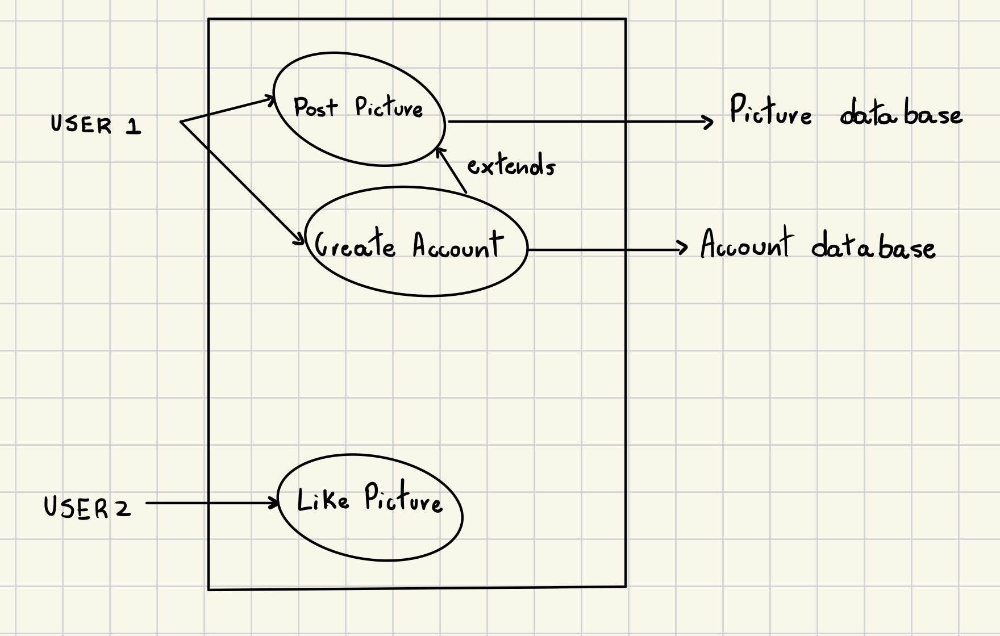
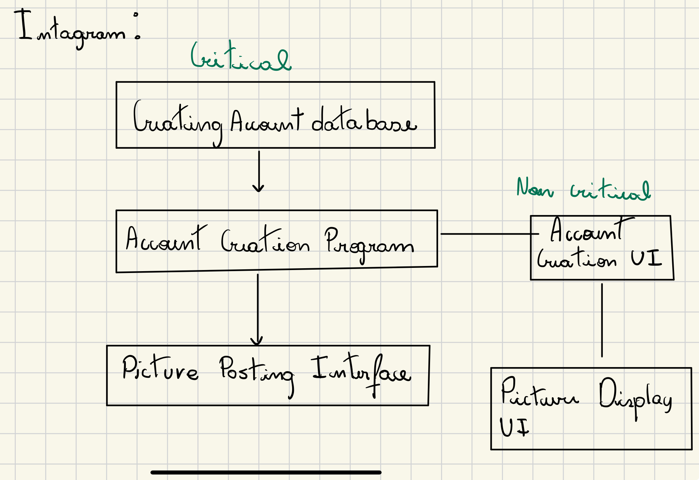

# CSCI 2113 - Worksheet J8
## Question 1. What is the difference between a functional and non-functional requirement?
A function requirement as a requirement of a specific functionality that the program must implement, some feature that must be included in the program 
## Question 2. Give two example functional requirements for Instagram.com.
Users must be able to display access each others pictures

Users must be able to create accounts 
## Question 3. Give two example non-functional requirements for Instagram.com.
Users must able to download and display the pictures within 100ms

The like buttons should big enough to be cliked by humans
## Question 4. Draw a use case diagram for Instagram.com with at least three uses cases shown, where at least one use case extends another, and there are two actors.

## Question 5. Why has software engineering evolved to often embrace agile development models over waterfall ones?
As software became a more complex and more applied to day-to-day uses, a lot of times it becomes hard to fully follow the SDE life cycle specially the part related to requirement gathering because those can change based on user feedback or sometimes there is no way of knowing certain requirements ahead of time. Therefore, SDE has given preference to methodolgies that emphasize quick and adaptable development.   

## Question 6. Draw a diagram where there are at least two interconnected paths: a critical path, and at least one non-critical path.

